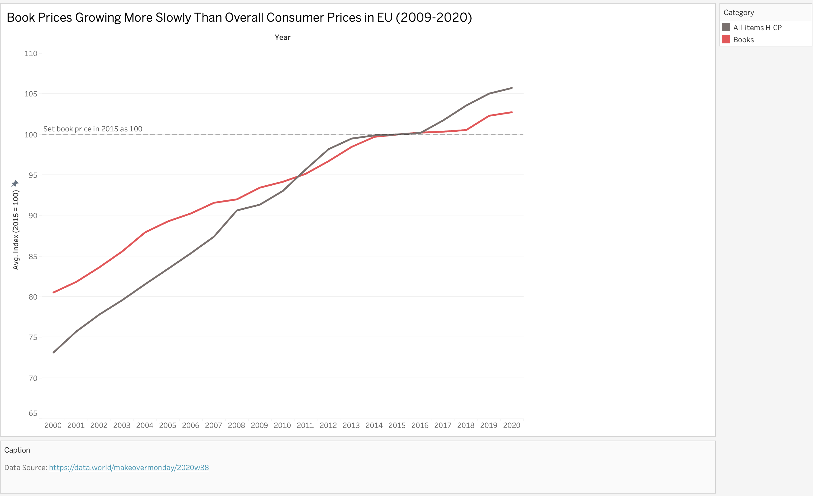

1. A link to the original data visualization (or screenshot - make sure to correctly cite your sources, etc.).  Include paragraph or two on why you selected this particular data visualization.  For obvious reasons, the data visualization you select should come from a publicly accessible source.  
# Pick up a book and read!
I choose this particular dataset out of curiosity to explore the pattern of book price after the surge of social media-driven content. This dataset is a good start to explore the
relationship between books and overall comsumer prices. When I first looked at the original visualization, I found that I couldn't understand the story behind it at all.
There are too many fluctuations of monthly data in two lines which makes it confusing to summarize the overall trend. Then the title doesn't answer my confusion neither. And the color for books price is not pop-out at the first glance.
Thus I decided to redesign this visualization to make it more clear and easy to understand.

Original dataset: [book-price](https://data.world/makeovermonday/2020w38)
Data description: The dataset contains the price index for books and all products different countries of every monthm from 2009 to 2020. The price index is set to 100 in 2015.

# My redesign journey
## Step 1: Critique the original visualization
According to the critique method, I think the original visualization is engaged because it uses an open book as background so it is easy to convey a message that the topic is related to books.
And there is adquate data on one page since my eyes are not jumping around but only focus on the two lines. However, the visualization is weak in the usefulness, completeness, perceptibility and intuitiveness.
The visualization is not perceptible because the two lines are too close to each other and the fluctuation is too much. The title also is not intuitive to the visualization that it doesn't answer any question.
Additionally, there is one annotation on the top left corner indicating the index is price in 2015. This is unclear to me at first so  I had to refer back to the original article to look
for clarification.

## Step 2: Sketches
According to the critique, I decided to aggregate the data into yearly data to reduce the fluctuation and make the trend clearer. 

To achieve this, these are steps I took in Tableau:

1. use price as rows and set it as average.
2. Preprocess date data using caculated field to get the year from the date. 
3. Set year data as columns.
4. Set country as filter and choose EU as the country
5. Use category as color and use the default color for books and all products
6. Set a reference line for 100 using analytics tools.

After that, I summarized the overall trend 
and used the conclusion as the new title. And I also delete the annotation for index but put a grey-dotted reference line to indicate the index.

This is the sketch of my redesign:

## Step 3: User feedback

Then I showed my sketch to two classmates and asked them to interpret the sketch. They all said that the trend is clear and they could see the overall trend easily after the change.
But there are some fields need to be improved. 
1. The color for books price is not pop-out at the first glance.
2. They still couldn't understand the meaning of the index even if it is indicated by the grey-dotted line.

## Step 4: Redesign according to the feedback
I change the color of book price to red and all products price to black to make the book price stands out.
And I changed the annotation of the reference line to '2015 prices are used as reference point, set to 100.' to make it clearer

This is the redesign according to the feedback:

This is not the end of the story. I did another round of user feedback of two friends and they like how I aggregated the data and considered the title and index.
There is just a minor change suggested that I could make the color of all products line to grey so the books line will be more outstanding.

## Step 5: Final visualization
Then this is my final visualization. I used red for book price and grey for all products price. I didn't change the chart type since it is appropriate to show trend over years using
line chart. But I refined the color and title to convey the conclusion and story behind the data.

From this visualization, users could easily tell the price trend for 
books is growing more slowly than overall consumer prices in EU from 2009 to 2020.

# Final visualization

    <noscript>
        
    </noscript>
    <object class="tableauViz" style="display:none;">
        <param name="host_url" value="https%3A%2F%2Fpublic.tableau.com%2F" />
        <param name="embed_code_version" value="3" />
        <param name="site_root" value="" />
        <param name="name" value="book-price_17315347545370/Sheet2" />
        <param name="tabs" value="no" />
        <param name="toolbar" value="yes" />
        <param name="static_image" value="https://public.tableau.com/static/images/bo/book-price_17315347545370/Sheet2/1.png" />
        <param name="animate_transition" value="yes" />
        <param name="display_static_image" value="yes" />
        <param name="display_spinner" value="yes" />
        <param name="display_overlay" value="yes" />
        <param name="display_count" value="yes" />
        <param name="language" value="en-US" />
        <param name="filter" value="publish=yes" />
    </object>

