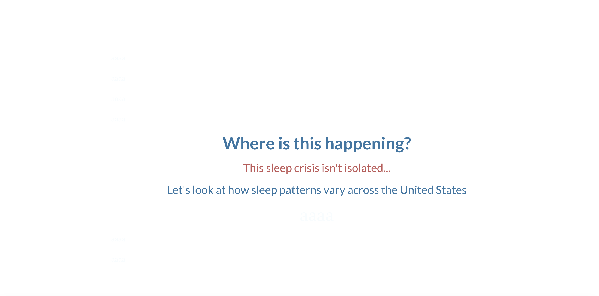
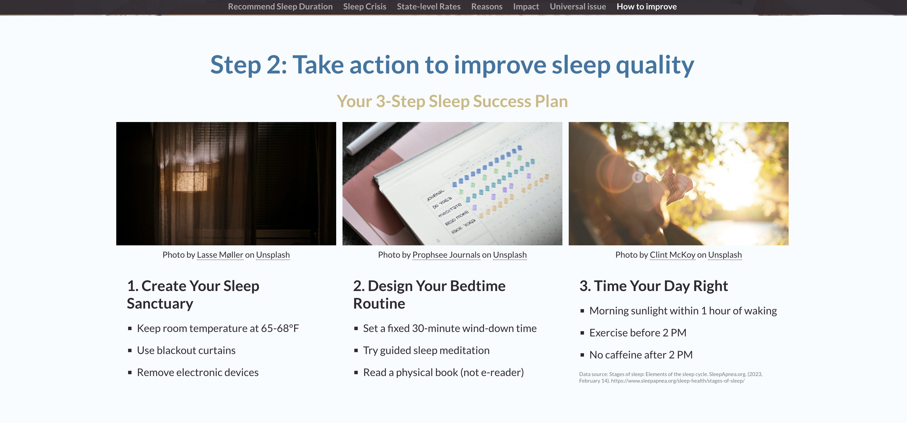
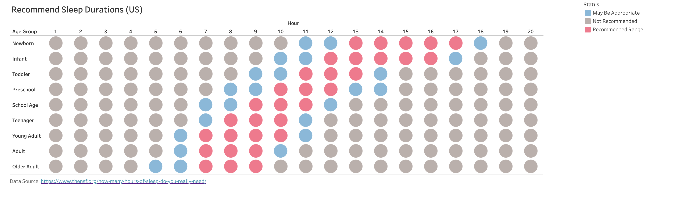
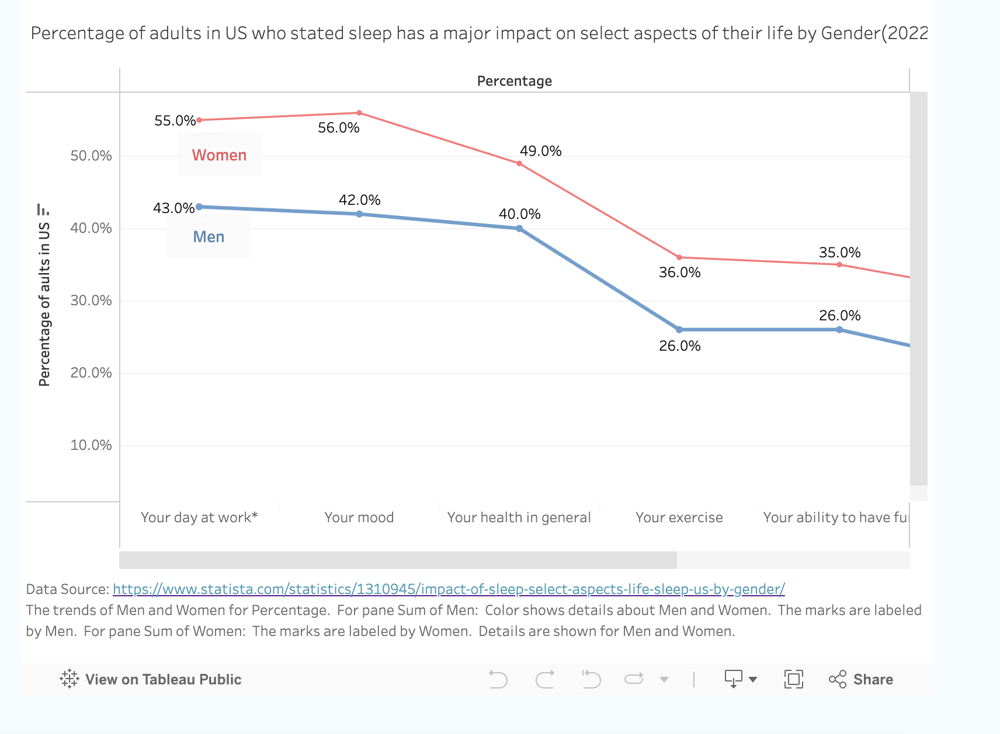
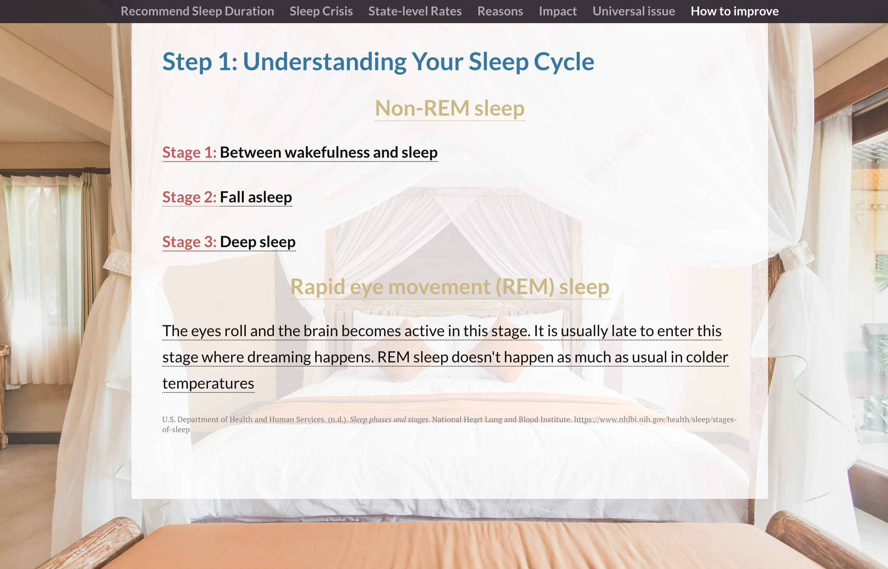

| [home page](https://wendy-ma.github.io/portfolio/) | [visualizing debt](https://wendy-ma.github.io/portfolio/government-debt/visualizing-government-debt.html) | [critique by design](https://wendy-ma.github.io/portfolio/books-price/critique-by-design.html) | [final project I](https://wendy-ma.github.io/portfolio/part1/final_project_WendyMa.html) | [final project II](https://wendy-ma.github.io/portfolio/part2/final_project2_WendyMa.html) | [final project III](https://wendy-ma.github.io/portfolio/part3/final_project3_WendyMa.html) |

# Final Project Part III :The final data story
https://carnegiemellon.shorthandstories.com/insufficient-sleep/index.html

# Changes made since Part II

1. I added a few pages to improve the narratives to ensure that the audience could have a better understanding about the logic and the whole story here.
Belows are the changes I made:

To transit from the overall percentage students having insufficient sleep to the geographic pattern, I added one page to introduce the reason why we need to look at the geographic distribution. That's because I would like to dig deeper into how the overall percentage of students distributed in the US.

After introducing the overall situation of insufficient sleep, it's the time to look at the reasons behind why people have poor night quality.

After understanding the reasons of insufficient sleep, I would like to stress the negative impact of lack of sleep.

After talking about the impact, I would like to introduce an interesting phenomenon that annual income doesn't affect the percentage of insufficient sleep. Everyone could be affected so we are not alone.

Finally, I would like to provide some tips on how to improve sleep quality and how to build a healthy sleep routine. The call to action will be encouraging the audience to take actions to recover their healthy sleep pattern.

2. The second kind of changes I made are for the content. I have tried to enrich the content to make it more informative and engaging.

I added one paragraph to introduce what insufficient sleep will cause negatively to our health in detail.

Besides directly showing the methods to improve sleep quality, it is also necessary for us to understand our sleep cycle before designing our personal bedtime routine.

I think that professor gave me a really good feedback for my part 2 assignment that I could give more specific call to action. So based on the previous six recommendations, I gave out a more detailed and direct instructions for preparing a suitable sleep environment and designing bedtime routine.

3. Other changes I made are tweaking the font size and color to make the visualization more readable and engaging. I also added citations for the data source to make the story more reliable.

## The audience

My intended audience are college students who have insufficient sleep. I am one of them and always looking for ways to improve my sleep quality. I think this study could let them know that they are not the only one that have sleeping problems and there are many ways to improve their sleep quality. I also hope that they could take actions to recover their healthy sleep pattern after reading this story.
And there are many interesting insights could help them even decide which state they could move to if they care about their sleep quality.

At first my focus audience are all people who have sleeping problems. But when I interviewed some friends, they suggested that I should focus on one specific group of audience.
So I decided to face the college students and then looked for data for the overall percentage and geographic distribution for college students who are lack of sleep. And I made the data points pop out to make the story more eye-catching and engaging.
At the beginning of the story, I directly show the recomended sleep duration for different age groups including young adults to let the target audience know clearly about the ideal sleep duration.
Another thing I tailored for the audience is the plan to design a better sleep routine. The call to action is more specific and easier for student to follow.
## Final design decisions

My narrative is starting with experts' recommendation of sleep duration for different age group including college students, which conflicts with the reality that 60% of students didn't get enough rest.
Then I'd like to show how these percentage of students distributed in each state. In this part, I see an interesting overall trend that southern states have higher rate of insufficient sleep than northern states in college students.
After introducing the status of insufficient sleep, I would like to dig deeper into the reasons behind why people have poor night quality and its negative impact on daily activities. Then I dig deeper into the relationship between income level and 
insufficient sleep. Finally, the call to action is to firstly understand our sleep cycle and then a plan to design our sleep routine.

I used this bubble chart to display the sleep duration for different age groups. I think this chart is easy to understand and show the changes when people grow older. 

I chose line chart to show the percentage of impacted women and men because it is clearer to show the percentage and women are more likely to be affected than men in all categories.

## References

This page is the only one flagged by Turnitin. Since Non-REM sleep and REM sleep are jaragon, I didn't quoate them in the text. But I have added the citation link.

# Final thoughts

The whole process is interesting and I learned how to make visualizations according to audience needs. Before this class,
sometimes when making the slides I tended to be more creative than intuitive. But now I know that the most important thing is to make the audience understand the story behind the data. 
Most of the time, the simplist plot is the best. More than techniques, I learned more thinking pattern to critisize the plot and make improvement, which I already used it in my capstone presentation.
